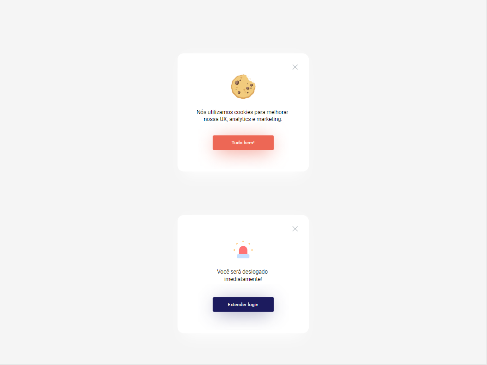
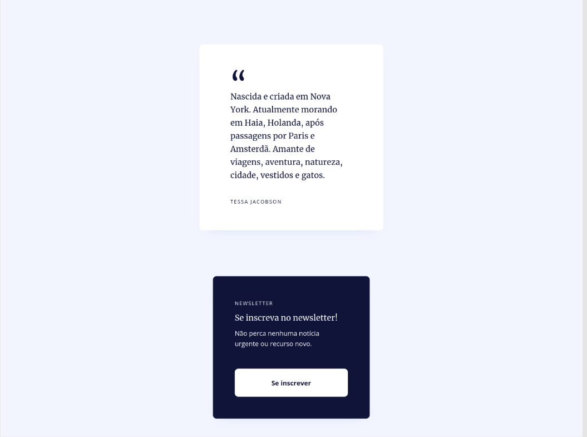
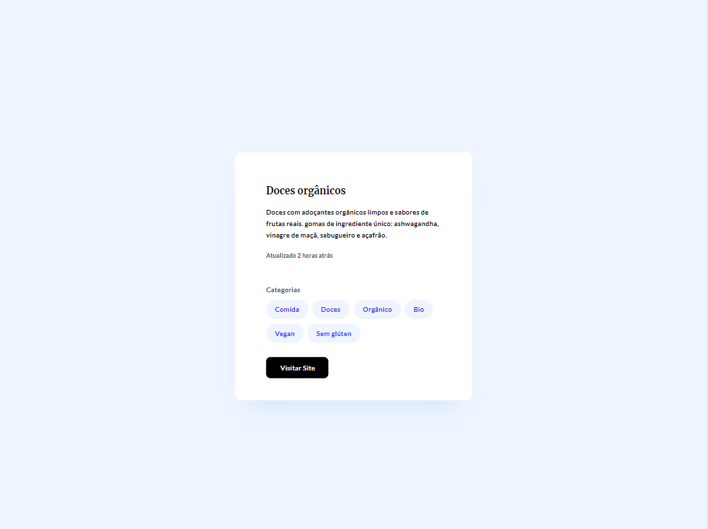
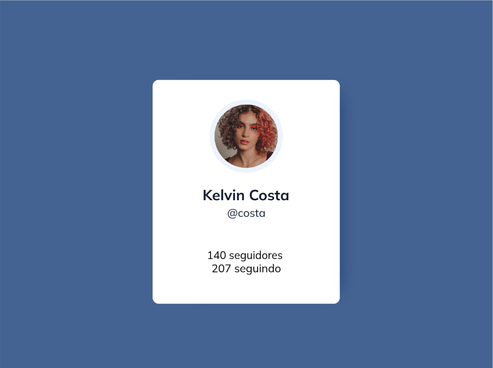
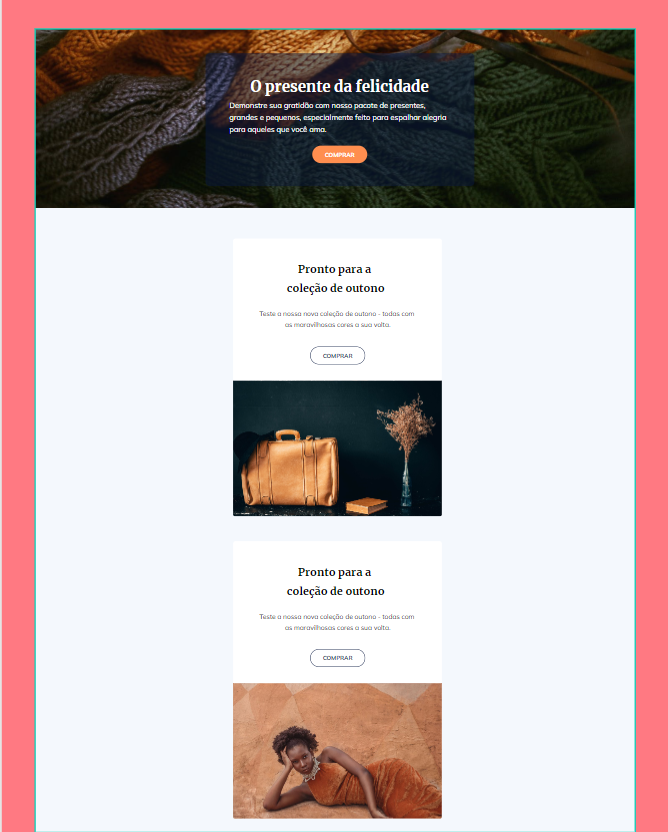

# Layout flow

## Objetivo

Construir os layouts presentes no arquivo _layout-flow.penpot_ usando o layout flow

## Contexto

Segundo o MDN, layout flow é a forma como os elementos Block e Inline são exibidos em uma página antes de qualquer alteração ser feita em seu layout. O fluxo é essencialmente um conjunto de elementos que trabalham juntos e "sabem" uns sobre os outros dentro do layout. Quando algo é retirado do fluxo, ele passa a funcionar de forma independente.

No fluxo normal, elementos inline são exibidos na direção inline, ou seja, na direção em que as palavras são exibidas em uma frase, de acordo com o modo de escrita do documento. Elementos block são exibidos um após o outro, como parágrafos, no mesmo modo de escrita do documento. No inglês, por exemplo, os elementos inline são exibidos sequencialmente da esquerda para a direita, enquanto os elementos block começam no topo e se movem para baixo na página.

## Layouts propostos

Ao todos, existem 5 layouts propostos. São eles:

### Alertas

### Newsletter

### Post de Blog

### Card de perfil

### Loja de presentes

